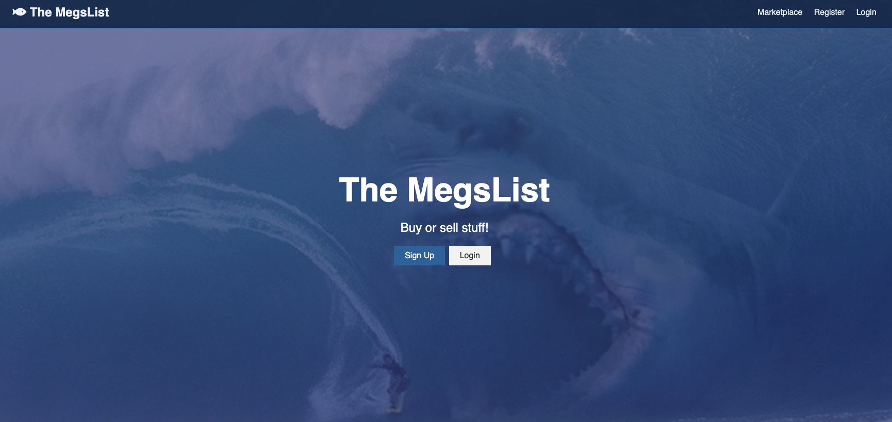
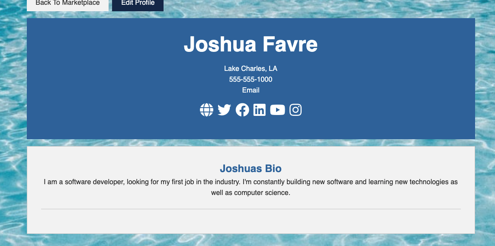
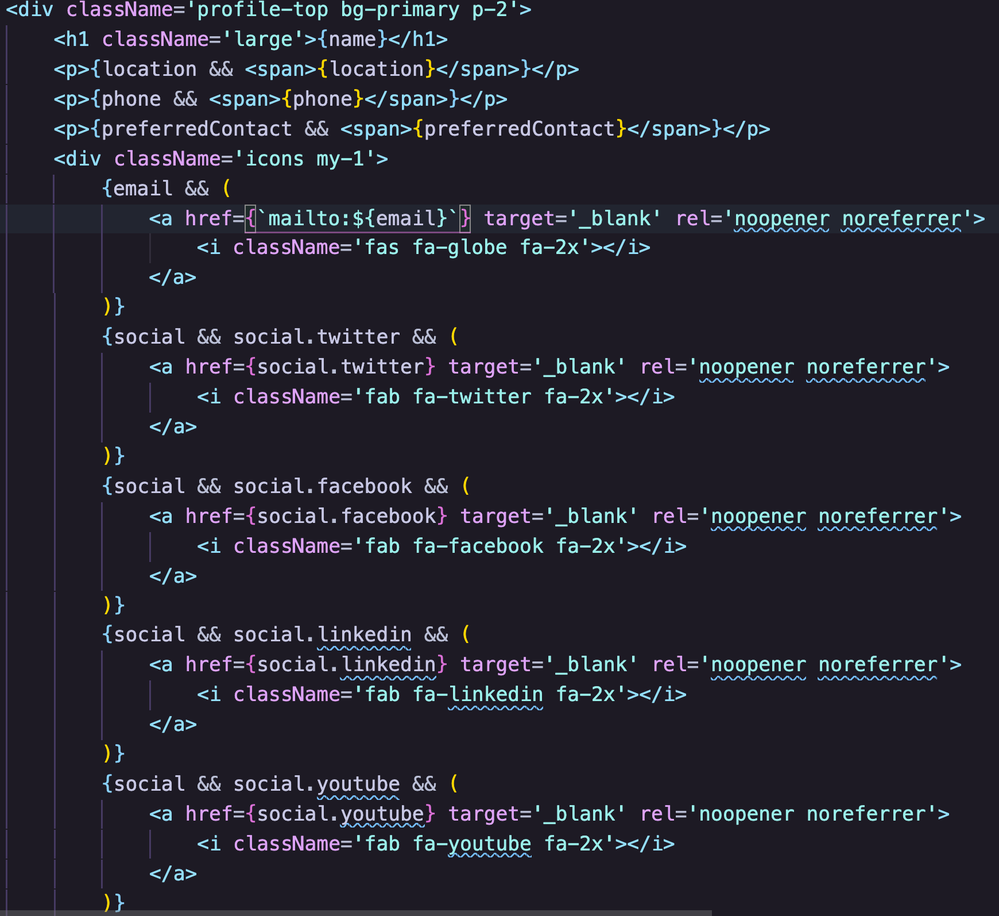
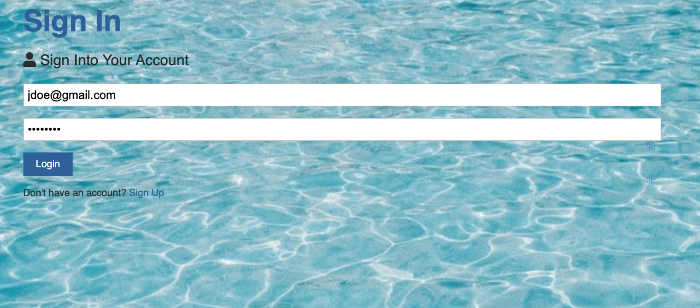
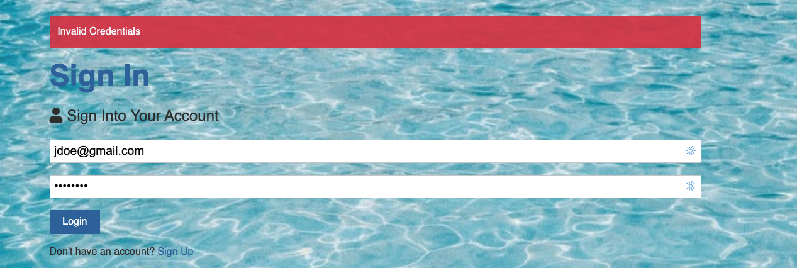
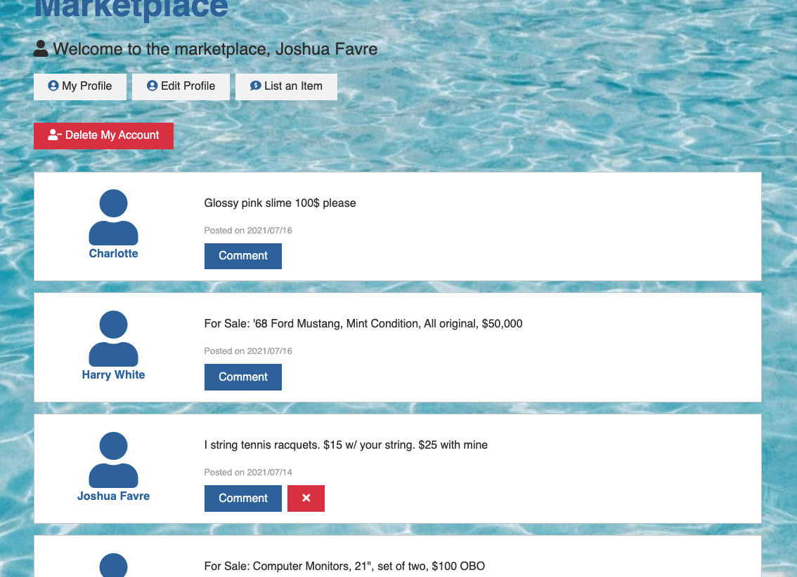
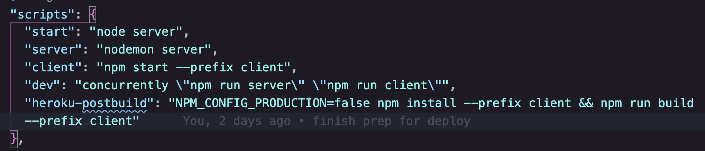

# [theMegslist](https://themegslist.herokuapp.com/)

### Buy or sell products and services with ease!

#### theMegsList is a marketplace application built on the MERN stack with Redux. Users can create an account which gives them the capability to post their items or services to the marketplace. Or post that you are in search of a specific product or service. 

#### I built this app as a project to solidify my knowledge of using Redux on a full stack React app. This project was definetely helpful. I learned a lot of good practices with Redux, as well as, better error handling, and authentication practices.

## Landing Page
##### The landing page that prompts the user to sign up or sign in

## Profile Form
##### Create your profile with the info you would like to use to be contacted

## Profile
##### The profile page, showing provided information. The social media icons are links and only appear if provided

##### Code snippet for only showing provided profile information

## Sign In
##### Sign in page

##### With alert

## The Marketplace
##### This is the main feature of the app. This is where all post are displayed. Authenticated users can make posts, comment on posts, and see other users' profiles.

## Wireframe
##### Concept Marketplace

##### Concept Item Detail Page

##### Concept Profile Page

## Technologies Used
##### For theMegsList, the frontend was developed using React with hook components. I used Redux to manage state. For styling, I did not use any framework or library. I did try to use some more efficient styling practices, such as setting reusable colors, styles, and just being less redundant. Authentication was implemented using JWT. I created the backend using Node.JS with Express and Mongoose. I used MongoDB to create a NoSQL database. The app is deployed on Heroku using the free tier, so apologies for the slow initial load.  

### Code Snippet
##### I learned a new way to set up my scripts in package json on the server side to run the front end and back end with one command, also a clean way to run heroku postbuild

## Contribution Guidelines

If you have some cool ideas and would like to contribute, I will definitely consider it. Fork, clone, and send an issue if you have any proposed improvements to the app. This app is built for learning purposes, but I do appreciate any feedback. Thanks for checking it out.